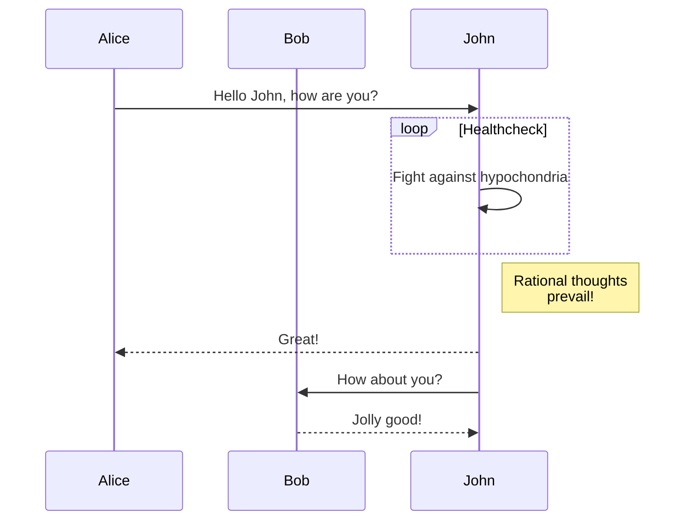
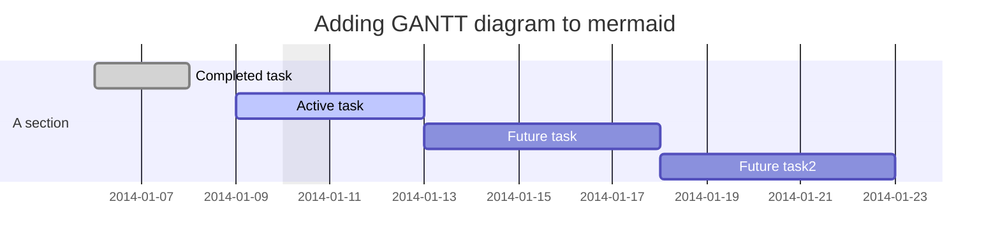

## Section

### Subsection

#### Sub-subsection


## Page config

```yaml
---
title: "Test"
categories: [test1, test2]
tags: [tests] # TAG names should always be lowercase
mermaid: true
math: true
comments: true
toc: true
pin: false
---
```

Refer for [this page](https://chirpy.cotes.page/posts/write-a-new-post/) for more stuff.

## Stuff

> An example showing the `info` type prompt.
{: .prompt-info }

> An example showing the `danger` type prompt.
{: .prompt-danger }

> An example showing the `warning` type prompt.
{: .prompt-warning }

> An example showing the `tip` type prompt.
{: .prompt-tip }

`/path/to/a/file.extend`{: .filepath}


```python
import numpy as np
x = np.zeros((2,2))
print(x)
```

```
[[0. 0.]
 [0. 0.]]
```
{: .nolineno }

```diff
import numpy as np
- x = np.zeros((2,2))
+ x = np.ones((2,2))
print(x)
```







{: w="200" h="200" }